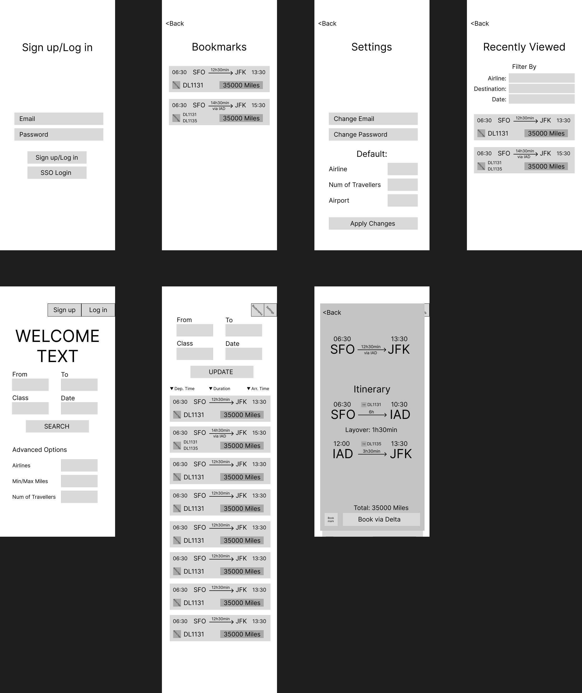
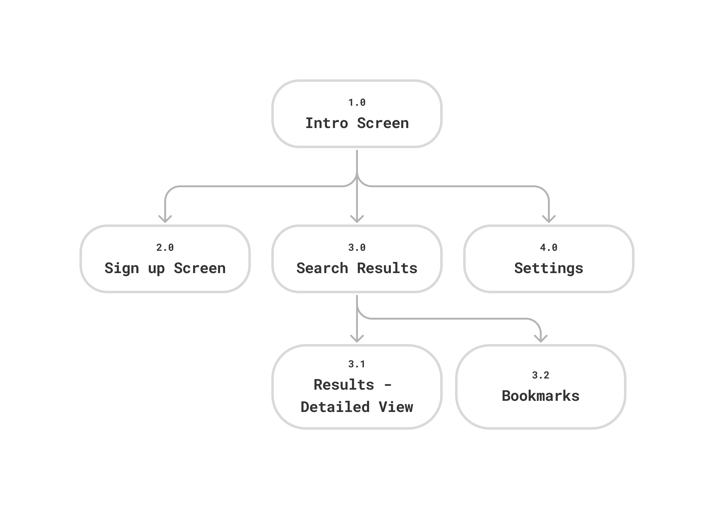

# User Experience Design

This repository contains instructions and files for two assignments that together comprise the user experience design phase of our web app.

## Milely Application Figma Prototype

[Link to Prototype](https://www.figma.com/proto/zicgzZ5BZTBo63kpwGqV5k/Wireframe---Prototype?node-id=0-1&t=cV9yAI8sbf4gj2eP-1)

## Milely Application Wireframe

# Mobile View:

# Desktop View:

## Milely App Map

Replace the contents of this file with the completed assignments, as described in:

- [app map & wireframe instructions](instructions-0a-app-map-wireframes.md).
- [prototype instructions](instructions-0b-prototyping.md)
